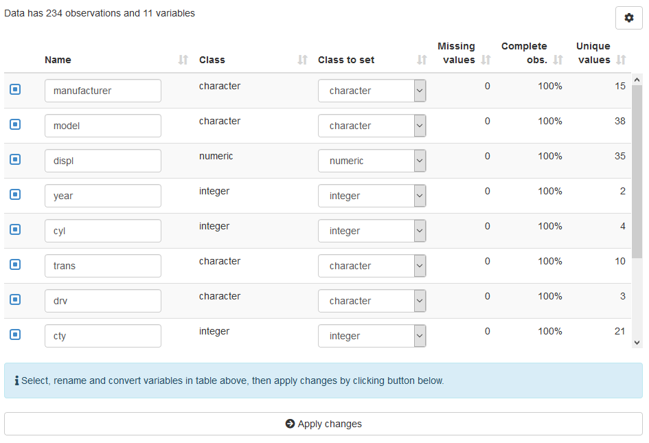
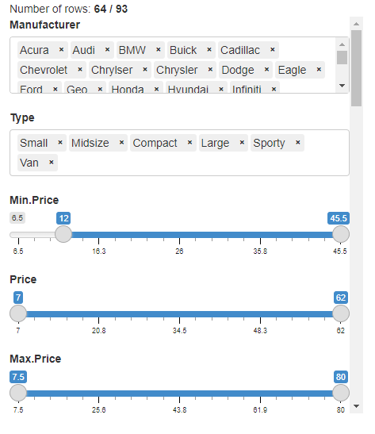

# datamods

> Shiny modules to import and manipulate data into an application or addin.

<!-- badges: start -->
[](https://www.tidyverse.org/lifecycle/#maturing)
[](https://github.com/dreamRs/datamods/actions)
[](https://codecov.io/gh/dreamRs/datamods)
<!-- badges: end -->


## Overview

This package provides custom shiny modules to import data from various sources, select, rename and convert variables in a dataset and validate content with [validate](https://github.com/data-cleaning/validate) package.  
The modules can be used in any standard shiny application or RStudio add-in.


### Installation

You can install the development version of datamods from [GitHub](https://github.com/dreamRs/datamods) with:

```r
remotes::install_github("dreamRs/datamods")
```


### Import

Import data from:

* **environment**: such as Global environment or from a package
* **file**: text files, Excel, SAS or SPSS format... anything that package [rio](https://github.com/leeper/rio) can handle
* **copy/paste**: paste data from an other source like Excel or text file
* **Google Sheet**: use the URL to import the Googlesheet

Each module is available in the form `import_file_ui()` / `import_file_server()` and can be use independently.

Or all modules can be launched together in a modal window via `import_modal()` / `import_server()`:


This module also allow to view imported data and to update variables.


### Update

Module `update_variables_ui()` / `update_variables_server()` allow to:

* **select** variables of interest in a dataset
* **rename** variables to be used in application after that
* **convert** variables to change their class, from character to numeric for example




### Validate

Define some validation rules with package [validate](https://github.com/data-cleaning/validate) and check whether data lives up to those expectations.


### Filter

Interactively filter a `data.frame`, this module also generates the code to reproduce the filters.




## Final Notes :

 - Please find example apps of each of the modules in the `/examples` folder.
 - For a detailed description, please see the vignette.
 - Read more about shiny modules [here](https://shiny.rstudio.com/articles/modules.html) and how to test them [here](https://mastering-shiny.org/scaling-testing.html)
